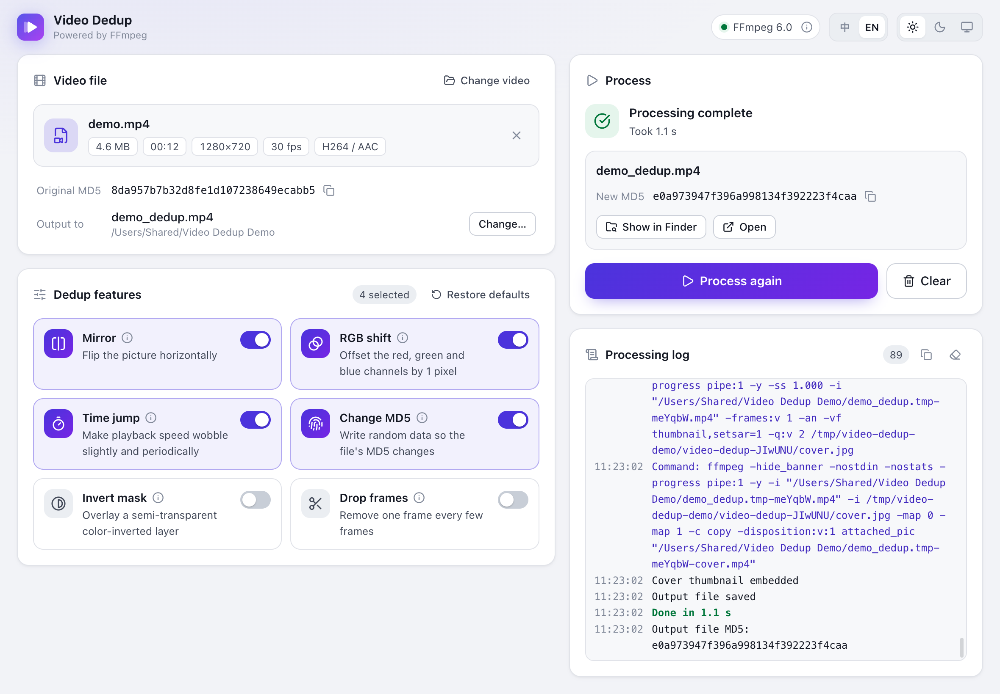

# Video Dedup

English | [简体中文](README.zh-CN.md)

A desktop app for “video dedup” (视频去重). Rather than finding duplicate files, it makes subtle changes to a video, such as mirroring, color channel shifts, and slight timing adjustments, and writes random information into the file, so that the output differs from the original both in its frames and as a file. Video processing is done by FFmpeg.

Built with Electron + React + TypeScript.

> This is an experimental project developed for learning and research, open-sourced under the [MIT License](LICENSE). Do not use it for anything illegal or that infringes on the rights of others. Please read the [Disclaimer](#disclaimer) before use.

<picture>
  <source media="(prefers-color-scheme: dark)" srcset="docs/screenshot-en-dark.png">
  
</picture>

## Download

Download the installer for your system from the [Releases](https://github.com/Caldalis/video-dedup-app/releases) page:

| System | File |
| --- | --- |
| Windows 10 / 11, 64-bit | `video-dedup-<version>-win-x64.exe` |
| macOS 15 or later, Apple silicon | `video-dedup-<version>-mac-arm64.dmg` |
| macOS 13 or later, Intel | `video-dedup-<version>-mac-x64.dmg` |
| Linux, 64-bit | `video-dedup-<version>-linux-x86_64.AppImage` |

The installers aren't signed with a paid developer certificate, so the system shows a warning the first time you open the app. On macOS, click **Open Anyway** in System Settings → Privacy & Security; on Windows, click **More info**, then **Run anyway**. The release notes explain this in detail.

## Features

| Feature | Effect | FFmpeg implementation |
| --- | --- | --- |
| Mirror | Flips the picture horizontally | `hflip` |
| RGB shift | Shifts the red channel right and the blue channel down by 1 pixel, leaving green in place, so any two channels are at most 1 pixel apart horizontally and vertically | `rgbashift` |
| Time jump | Nudges each frame's display time back and forth along a sine wave (up to ±0.04 s, with a period of 8 s) without changing the number of frames | `settb` + `setpts` |
| Change MD5 | Writes a random comment and does not carry over the original title and date; when it is the only feature selected, the audio and video streams are copied without re-encoding | `-metadata`, `-c copy` |
| Invert mask | Overlays a semi-transparent color-inverted layer with adjustable opacity (0.03 by default) | `lutyuv` |
| Drop frames | Drops 1 frame every N frames, or at random intervals of N to N+5 frames | `select` |

Time jump and Change MD5 are enabled by default.

- English and Simplified Chinese interface: follows the system language by default and can be switched in the top-right corner, with your choice remembered
- Light, dark, and system appearance, with your last choice remembered
- Drop a video anywhere on the window to select it; the app shows its duration, resolution, frame rate, codecs, and original MD5
- Shows progress, speed, and estimated time remaining while processing, and can be cancelled at any time; when finished, shows the new file's MD5 and can reveal the file in Finder or File Explorer
- Audio is copied without re-encoding whenever possible; MP4, M4V, and MKV outputs get an embedded cover thumbnail; WebM output uses VP9 + Opus
- Results are written to a temporary file first and renamed to the output file only after everything succeeds, so a failure or cancellation never leaves a partial file behind or damages an existing file with the same name

## Getting started

Requires Node.js 22.12 or later (24 recommended) and pnpm 11:

```bash
corepack enable        # or: npm install -g pnpm
pnpm install           # installs dependencies and downloads FFmpeg (about 45 MB)
pnpm dev               # starts in development mode; the UI reloads when its code changes. The first run downloads Electron (about 110 MB)
```

If downloads are slow (for example, in mainland China), set the following environment variables in your current terminal to use mirrors, then run the commands above:

```bash
# macOS / Linux
export ELECTRON_MIRROR=https://npmmirror.com/mirrors/electron/
export FFMPEG_BINARIES_URL=https://cdn.npmmirror.com/binaries/ffmpeg-static

# Windows PowerShell
$env:ELECTRON_MIRROR="https://npmmirror.com/mirrors/electron/"
$env:FFMPEG_BINARIES_URL="https://cdn.npmmirror.com/binaries/ffmpeg-static"
```

> pnpm 11 doesn't run the install scripts of dependencies by default. This project allows the ffmpeg-static script that downloads FFmpeg through `allowBuilds` in `pnpm-workspace.yaml`. If FFmpeg can't be found after installation, run `pnpm rebuild ffmpeg-static` to download it again.

## Commands

| Command | Description |
| --- | --- |
| `pnpm dev` | Start in development mode |
| `pnpm build` | Build into the `out/` directory |
| `pnpm start` | Start the production build |
| `pnpm typecheck` | Run type checking |
| `pnpm test` | Processing core tests: process test media with a real FFmpeg and check each effect on the actual output |
| `pnpm test:e2e` | UI tests: build the app and simulate user interactions with Playwright |
| `pnpm dist` | Package installers into the `dist/` directory |
| `pnpm dist:dir` | Only produce an app directory that runs directly, without an installer |

## FFmpeg

The app looks for FFmpeg in the following order:

1. The program specified by the `VIDEO_DEDUP_FFMPEG` environment variable
2. The FFmpeg shipped with the app: during development, the one ffmpeg-static downloads during `pnpm install`; once packaged, the one in `resources/ffmpeg` under the installation directory
3. FFmpeg installed on the system: on `PATH`, as well as in the default Homebrew and MacPorts directories on macOS

The top-right corner of the window shows the version of FFmpeg in use; click the ⓘ next to it to see its path. FFmpeg 5.1 or later is required. For example, to use FFmpeg installed with Homebrew:

```bash
VIDEO_DEDUP_FFMPEG=/opt/homebrew/bin/ffmpeg pnpm dev
```

The FFmpeg builds that ffmpeg-static provides for each platform all include the encoders this app uses (libx264, libvpx-vp9, libopus, libvorbis):

| Platform | FFmpeg version | License |
| --- | --- | --- |
| Windows x64 | 6.1.1 (gyan.dev) | GPLv3 |
| macOS (Intel) | 6.1.1 | GPLv3 |
| macOS (Apple silicon) | 6.0 | Includes nonfree components and cannot be redistributed; the installer uses a GPL build instead (see [Packaging](#packaging)) |
| Linux x64 / arm64 | 7.0.2 (johnvansickle.com) | GPLv3 |

**Timestamps**: When re-encoding, the app always adds `-fps_mode vfr -enc_time_base:v 1/90000` (omitting the latter for AVI, which can only record time in whole frames) to keep each frame's original display time:

- Before FFmpeg 7, output to formats such as MP4 is converted to a constant frame rate by default, which erases the time jump offsets and fills dropped frames back in.
- Encoders use a time base of 1/frame rate by default. When processing variable-frame-rate videos (such as those shot on phones or processed with time jump), two frames may be rounded to the same timestamp, and the second one gets dropped.
- `-enc_time_base:v filter` also preserves timestamps, but that syntax is only supported from FFmpeg 7 on, so the value is written as 1/90000, the same time base the time jump filter uses.

## Testing

`pnpm test` first generates test media with the current FFmpeg (cached in the system temp directory), then checks the following, item by item:

- Positions and intervals of dropped frames, how Invert mask changes the picture, and the actual displacement of each color channel after RGB shift
- Output pixel format, per-frame timestamps after time jump, and no frames lost from variable-frame-rate videos
- Containers, covers, and audio for each format, audio/video sync, and written metadata
- Portrait videos with rotation metadata, videos with subtitles, very short videos, and file names containing spaces, Chinese, and special characters
- Error messages, and no leftover files or processes after cancellation
- All interface text lives in the Chinese and English dictionaries, with no hard-coded Chinese left in the source

To test with a different FFmpeg:

```bash
VIDEO_DEDUP_FFMPEG=/opt/homebrew/bin/ffmpeg pnpm test
```

`pnpm test:e2e` launches the built app, with the tests answering system dialogs in place of the user, and checks the following operations:

- Choosing files, dropping files, and choosing files that can't be processed
- Option validation, processing, processing failures, and overwrite confirmation
- Cancelling, and closing the window during processing
- Keyboard shortcuts, menus, copying the MD5, and showing the file in Finder
- Switching appearance, a corrupted settings file, and launching a second instance
- Switching between English and Chinese: the interface, window title, dialogs and menus change, and the choice is kept after reopening
- The UI can't use Node.js directly or navigate to other pages

The tests use a separate user data directory, so they don't change your local settings, and they never actually open Finder or modify the clipboard.

## Packaging

```bash
pnpm dist
```

- Installers for each platform must be built on that platform: `pnpm dist` first runs `scripts/prepare-ffmpeg.mjs`, which prepares FFmpeg for the current platform in `build/ffmpeg/bin`, and packaging copies it into `resources/ffmpeg` together with its license (`COPYING.GPLv3`) and where to get its source code (`SOURCES.md`).
- The macOS build is ad-hoc signed by default, which needs no developer certificate. When others download it, macOS warns that the developer cannot be verified; they can choose Open Anyway in System Settings → Privacy & Security. Without a signature, macOS says the app is damaged and won't open it at all.
- If you have an Apple Developer ID certificate, sign with it and enable the hardened runtime when packaging, then notarize following [electron-builder's instructions](https://www.electron.build/code-signing): `pnpm dist -c.mac.identity="Certificate Name" -c.mac.hardenedRuntime=true`. No signing is configured for the Windows build.
- **FFmpeg license**: Distributing an installer means distributing the FFmpeg inside it, which requires including the GPL license and providing a way to obtain the source code; the files in `build/ffmpeg` cover this. The FFmpeg that ffmpeg-static downloads on Apple silicon Macs was compiled with `--enable-nonfree`, and `ffmpeg -L` shows that it cannot be legally redistributed, so on these Macs the script downloads a GPL static build published by the [Shaka Project](https://github.com/shaka-project/static-ffmpeg-binaries) instead and verifies its checksum. That build requires macOS 15 or later, so the Apple silicon installer does too; the Intel installer works on macOS 13 and later.
- **Releasing**: Push a tag such as `v1.0.0` that matches the version in `package.json`. GitHub Actions (`.github/workflows/release.yml`) then runs the tests with the FFmpeg to be bundled, builds the installers on Windows, macOS (Apple silicon and Intel) and Linux, and creates a draft release with the installers and their checksums. Add what's new to the draft, then publish it. You can also run the workflow manually from the Actions page: it then only builds, and the installers are in the run's artifacts.

## Project structure

```
src/
├── core/          Processing core: calls FFmpeg, depends only on Node.js, independent of the UI
│   ├── processor.ts   VideoProcessor: re-encoding or stream copying, cover embedding, temp files, cancellation
│   ├── filters.ts     FFmpeg filters for each feature
│   ├── probe.ts       Reads duration, resolution, codecs, and other information
│   ├── ffmpeg.ts      Locates FFmpeg and reads its version and encoders
│   └── files.ts       MD5, default output path
├── shared/        Shared by the main process and the UI: option definitions and validation, interface text in Chinese and English (i18n/), IPC interfaces
├── main/          Electron main process: window, menu, dialogs, processing jobs, appearance settings
├── preload/       Exposes window.api to the UI
└── renderer/      React UI (header, video file, dedup features, processing, log)
tests/
├── core/          Unit and integration tests for the processing core
├── e2e/           UI tests
├── helpers/       Test media, plus checks that can be done with FFmpeg alone
└── setup/         Generates test media
build/icon.png     App icon
build/ffmpeg/      FFmpeg's license and where to get its source code, included in the installers
scripts/           Prepares the FFmpeg bundled into the installers
docs/              Screenshots used in the README
.github/           Release workflow: builds the installers and creates a draft release
```

The UI runs in a sandbox and can't use Node.js directly; it can only call the few methods provided by the preload script, and the main process validates every argument it receives. The packaged pages have a Content Security Policy that only loads the app's own scripts and styles.

## Disclaimer

This is an experimental project for learning and researching Electron desktop app development and FFmpeg video processing. It is not a mature software product, and its features and processing results may change at any time. Please read the following carefully before use.

**Video sources**: Only process videos you own the copyright to (for example, videos you shot or made yourself), or videos the copyright holder has authorized you to use.

**Do not use this project for any of the following**, as they may violate laws and regulations, infringe on the rights of others, or break platform rules:

- Reposting or redistributing other people's videos without authorization, or passing off other people's work as your own original content
- Circumventing video platforms' copyright protection, originality checks, duplicate content detection, or similar mechanisms
- Mass-producing or publishing duplicate content, inflating traffic, or fraudulently obtaining platform revenue sharing, traffic support, or rewards
- Creating or spreading illegal, false, pornographic, violent, or other prohibited content
- Impersonation, fraud, defamation, or any other infringement of others' copyright, likeness, reputation, privacy, or other lawful rights and interests
- Any other conduct that violates laws and regulations, or the terms of service or community guidelines of video platforms

**No warranty**: This project is provided “as is”, with no guarantee that it works correctly, completely, or reliably, that processing results will achieve any particular effect, or that it will continue to be maintained and updated.

**Use at your own risk**: You are responsible for complying with the laws and regulations where you are and the rules of the platforms you use. You bear all consequences arising from the use of or inability to use this project, including but not limited to account restrictions or bans, copyright disputes, financial loss, data loss, administrative penalties, and legal liability. The authors and contributors of this project accept no liability whatsoever.

**Modification and redistribution**: Anyone who modifies, packages, or redistributes a version based on this project is solely responsible for that version.

This disclaimer may be revised at any time; the latest version applies.

## License

This project's code is open-sourced under the [MIT License](LICENSE).

The MIT License applies only to this project's own code. Third-party software used by this project is released under its own licenses. In particular, the FFmpeg packaged into the installers is licensed under the GPL, and the build for Apple silicon Macs also contains components that cannot be redistributed; comply with its license when distributing installers (see [Packaging](#packaging)).
